# Zac's Portfolio

Hi, my name is Zac. This portfolio is a <b>collection of projects</b>  I developed throughout college and during independent study, <i>with a focus on data analysis, business intelligence, applied machine learning, and analytical application development</i> (I just winged this one).
  
Each project started with a practical question: how should a dealer position its inventory, how can a recommender reduce choice overload, or what can customer behaviour reveal about retention and demand? The work is not presented as flawless. Where a model underperformed or the data could not support a definitive conclusion, I kept that visible and treated it as part of the analysis.

> PS. The banner above links directly to my LinkedIn profile.

## Table of Contents

* [Quick Summary](#quick-summary-table)
* [01 - Car Market Intelligence Analysis](#01---car-market-intelligence-analysis-)
* [02 - Anime Recommendation Website](#02---anime-recommendation-website-college-final-project)
* [03 - Online Retail Exploratory Data Analysis](#03---online-retail-exploratory-data-analysis)
* [04 - Nata Supermarket Business Analysis](#04---nata-supermarket-business-analysis)
* [05 - Online News Popularity Analysis](#05---online-news-popularity-analysis)

www## Quick Summary Table

| Project                              | Main Focus                                                      | Main Output                                          |
| ------------------------------------ | --------------------------------------------------------------- | ---------------------------------------------------- |
| **Car Market Intelligence Analysis** | UAE used-car inventory and competitive pricing                  | Interactive dealer and vehicle comparison dashboard  |
| **Anime Recommendation Website**     | Recommendation systems and full-stack analytical applications   | End-to-end recommendation-system prototype           |
| **Online Retail EDA**                | Customer retention, sales trends, and product affinity          | Customer segmentation and commercial recommendations |
| **Nata Supermarket Analysis**        | Customer demographics, purchase channels, and product behaviour | Business analysis with experimental forecasting      |
| **Online News Popularity Analysis**  | Article performance and share prediction                        | Content-performance analysis and model comparison    |

 

  

### 01 - Car Market Intelligence Analysis 🚗

#### **Objective**:

Investigate how used-car sellers in the UAE position their advertised inventory and pricing. Specifically, the project looked into:

* Which sellers have the largest advertised inventory presence?
* Which makes, models, trims, and model years dominate the collected sample?
* How do dealer prices compare for equivalent vehicles?
* Which listings sit above or below the wider market average?
* How can this information support provisional pricing and inventory decisions?

#### **Data Source**:

The data was collected from a public UAE used-car marketplace using a private Selenium-based scraper. Processed listing data was stored in PostgreSQL.

The public repository focuses on the analysis and dashboard layer. The scraper will remain private to avoid exposing marketplace-specific collection logic 🤫.

#### **Outputs and Findings**:

1. A private collection pipeline and PostgreSQL database for storing marketplace listings.
2. A **Dash application** with two main analytical views:
   * **Dealer Comparison** — compares a selected dealer's listing prices against other dealers carrying the same vehicle configuration.
   * **Vehicle Comparison** — compares selected vehicles against broader market-average prices.
3. Key observations:
   * Advertised inventory presence varied considerably between dealers.
   * Multiple dealers listed identical or closely comparable vehicle configurations at different price points.
   * Pricing strategy appeared to vary by vehicle rather than following one consistent dealer-wide premium or discount position.
   * Dealers appeared to use both incremental listing updates and larger batch uploads. The present data cannot determine which approach generates more leads.
   * Vehicle-level comparison can help identify entry-level, mid-market, and premium alternatives within the same segment.

#### **Recommendation**:

The dashboard should be used as a **relative market-positioning tool**, not as proof of demand or completed sales.

A useful next test would be to track competitively priced listings over a longer period and connect listing status with verified lead and sale outcomes. This would help distinguish between:

* Premium pricing supported by vehicle condition, mileage, specification, or scarcity (Justified overpricing)
* Market-aligned pricing
* Aggressive lower-price strategies intended to increase enquiry or inventory turnover

#### **Limitations**:

* Listing volume does not represent sales volume, revenue, or conversion. 
* A removed listing cannot be classified as a confirmed sale. Assuming so falls trap to a demand proxy.
* The collection period (1 Day of Data) is too limited to establish long-term demand patterns.
* Stronger price comparisons would require other car specificationsm, i.e. mileage, condition, regional specification, service history, and additional vehicle attributes.

#### **Technologies**:

**Python · Pandas · NumPy · Plotly · Dash · SQLAlchemy · PostgreSQL · Selenium**

#### **Repository**:

[View Car Market Intelligence Analysis](https://github.com/ZicoSabine/Car-MI-Analysis)

#### **Pictures**:

***Exploratory Dashboard***

.png>)

***Dash Application: Dealer Comparison***

.png>)

***Dash Application: Vehicle and Market Comparison***

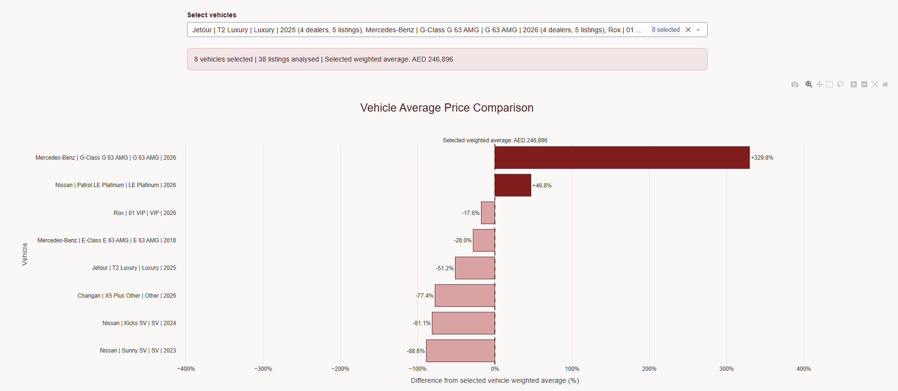

 

  

### 02 - Anime Recommendation Website (College Final Project)

#### **Objective**:

The main objective of this anime recommendation app is to get over the moment of *"what should I watch next?"*

The project also explored the idea of an **Anime Watching Paradox**, adapted from the Paradox of Choice: the more titles available to a viewer, the harder it can become to select the next one.

Rather than stopping at a notebook model, I built the project as an end-to-end prototype covering data collection, model training, ranking evaluation, API development, frontend integration, deployment preparation, and user testing.

#### **Data and Preparation**:

Data was collected through the [Jikan API](https://github.com/jikan-me/jikan), an unofficial API for MyAnimeList data.

Data collection wThe collected datasets contained:

* **28,393 anime titles**
* **83,184 user reviews**

Reviews with a score of **7 or higher** were converted into positive implicit interactions. After filtering, the model dataset contained:

* **52,466 positive interactions**
* **24,614 users**
* **9,339 anime titles**

User and anime identifiers were converted into contiguous numerical indices for use in PyTorch embedding layers. Reviews were grouped by anime, tokenised, truncated to a maximum of 100 tokens, and converted into a shared text representation for each title.

#### **Model Architecture**:

The model is an adjusted **Neural Matrix Factorisation model**, combining Generalised Matrix Factorisation, a Multi-Layer Perceptron, and a review-text encoder.

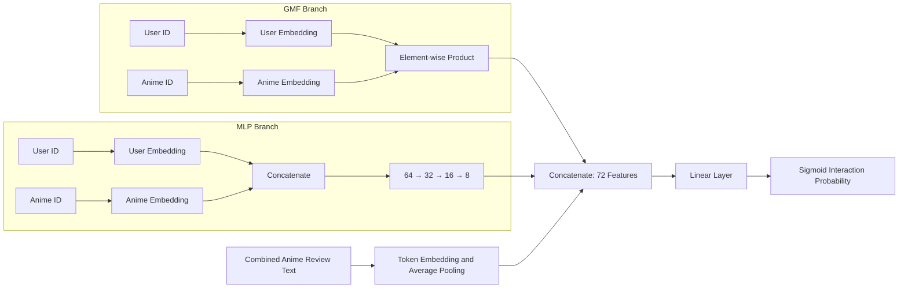

The three model branches serve different purposes:

1. **Generalised Matrix Factorisation** captures relatively direct user–anime preference relationships using 32-dimensional embeddings (Preserves user-time interactions).
   - *A likes Naruto and One Piece, B likes Dragon Ball and Naruto. Model thinks A will like Dragon Ball*
2. **Multi-Layer Perceptron** captures nonlinear interactions through a `64 → 32 → 16 → 8` (8 key features; Can be changed to 16 for future testing) network with ReLU activation and dropout.
   - *A watched Action, Comedy. After, A watches Comedy, Romance. Model thinks A will like x show if has Comedy.*
3. **Review-Text Encoder** converts pooled review tokens into a 32-dimensional (Minimum for model semantic capacity) item representation.
   - *Model 1 and 2 can't read. Model 3 reads and links review words with anime.*

The outputs are combined into a 72-dimensional vector and passed through a final linear layer and sigmoid function.

#### **How the Training Data Was Implemented**:

The model was trained as an implicit-feedback binary classifier, meaning:

- Positive reviewed anime received a label of `1`.
- Four unobserved anime were randomly sampled for every positive training interaction and labelled `0`.
- These negatives represent titles the user had not interacted with (not confirmed dislikes).

A **leave-one-out split** was used for each user:

- Most recent positive interaction → **Test set**
- Second-most recent positive interaction → **Validation set**
- Earlier interactions → **Training set**

The model used:

- Binary cross-entropy loss
- Adam optimiser
- Learning rate of `0.001`
- Batch size of `1,024`
- Maximum of 10 epochs
- Early stopping based on validation HR@10

#### **Evaluation Method**:

The project used sampled top-10 ranking evaluation.

For each evaluated user, the model ranked:

- One held-out positive anime
- Ninety-nine randomly sampled alternatives

The following metrics were calculated:

| Metric           |   Result | Interpretation                                                                                    |
| ---------------- | -------: | ------------------------------------------------------------------------------------------------- |
| **HR@10**        | **0.20** | The held-out relevant title appeared in the top ten for approximately one in five evaluated users |
| **NDCG@10**      | **0.09** | Relevant titles were generally positioned low within the ranking                                  |
| **Precision@10** | **0.02** | Few of the ten recommended items were relevant under the one-positive evaluation setup            |
| **Recall@10**    | **0.20** | The model recovered the held-out item for a limited share of users                                |
| **MRR**          | **0.06** | The first relevant item usually appeared relatively low in the results                            |
| **MAP@10**       | **0.06** | Overall ranking quality remained limited                                                          |

> Generalisation also declined from HR@10 of `0.24` to `0.20` and NDCG@10 of `0.11` to `0.09` on unseen data.

**The model therefore demonstrated a functioning recommendation pipeline, but not production-level recommendation quality.**

#### **Application Architecture**:

1. **FastAPI Backend (Frontend Interface)**

   - Paginated anime catalogue
   - Anime details
   - Title search
   - Recommendations by title or anime ID
   - Feedback submission
   - Feedback export to CSV

2. **React and Vite Frontend (Backend Logic)**

   - Catalogue browsing
   - Search and title selection
   - Recommendation display
   - Related-series prioritisation
   - Star ratings and written feedback

3. **Recommendation Serving (Recommendation Model)**

   - Extracts trained anime embeddings
   - Calculates item-to-item similarity
   - Applies limited genre and franchise reranking

Because the public interface recommends from a selected title rather than a signed-in user history, the application is best described as an **item-to-item recommendation prototype using NeuMF-learned embeddings with heuristic reranking**.

Given future improvements, MAL account may be linked so user history can be used for testing against the model.

#### **Outputs and Findings**:

- Built and connected the model, API, catalogue, recommendation interface, and feedback system.
- Evaluated the model with ranking metrics rather than relying only on training loss.
- Identified substantial generalisation and sparsity limitations.
- Conducted user testing, which produced an average rating of **3.15 out of 5**.
- Feedback highlighted opportunities to improve readability, navigation, visual content, recommendation explanations, and overall interface polish.

The main outcome was not a production-ready recommender. It was a functioning full-stack prototype that made the gap between *a model that runs* and *a recommendation experience users can trust* measurable.

#### **Limitations and Next Improvements**:

- Collected reviews had too few positive interactions to learn reliable personalised embeddings.
- The evaluation ranked one positive item against 99 sampled alternatives rather than the full catalogue.
- Review text was represented through basic average-pooled embeddings and did not capture word order or deeper semantic meaning.
- The current website flow is primarily item-to-item rather than fully personalised.
- Stronger baselines, improved negative sampling, full-catalogue evaluation, cold-start handling, and clearer explanations are required.

#### **Technologies**:

**Python · PyTorch · Pandas · NumPy · FastAPI · Pydantic · React · React Router · Vite**

#### **Project Status**:

Functional local prototype. Netlify and Render deployment configurations are included, but current live availability requires follow-up.

#### **Repository**:

[View Anime Recommendation Website](https://github.com/ZicoSabine/Anime-Recommendation-Website)

#### **Pictures**:

***Anime Catalogue***

***Recommendation Interface***

 

  

### 03 - Online Retail Exploratory Data Analysis

#### **Objective**:

Analyse a transactional online-retail dataset to understand customer activity, product performance, sales trends, customer value, and frequently purchased product combinations.

What began as an exploratory notebook developed into a broader commercial analysis covering:

- Transaction and customer volume
- Product demand
- Country-level revenue
- Weekly, monthly, and quarterly trends
- Customer segmentation
- Product affinity and bundle opportunities

#### **Data Source and Preparation**:

The project used the [UCI Online Retail Dataset](https://archive.ics.uci.edu/dataset/352/online+retail), containing transactions from a UK-based online retailer.

The original dataset contained **541,909 rows**. The cleaning process removed duplicated records, cancelled invoices, bad-debt adjustments, negative quantities, inventory write-offs, and unusable descriptions.

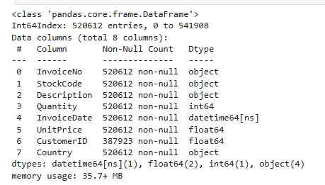

The retained analytical dataset contained:

- **520,612 transaction lines** *(21,297 removed)*
- **20,131 invoices**
- **4,339 identified customers**

#### **Analytical Methods**:

- Data-quality assessment and transaction cleaning
- Revenue calculation using quantity and unit price
- Product-frequency and quantity analysis
- Country-level revenue analysis
- Weekly, monthly, and quarterly time-series aggregation
- RFM customer segmentation
- Apriori market basket analysis

#### **Findings**:

1. **Repeat purchasing was a major part of the business.**

   - The retained data averaged approximately **4.64 invoices per identified customer**.
   - This suggests a meaningful recurring-customer base, although invoice count alone does not prove long-term loyalty.

2. **Home décor and reusable bag products appeared frequently.**

   - `WHITE HANGING HEART T-LIGHT HOLDER` appeared in **2,304 transaction lines**, making it the most frequently occurring product description in the cleaned data.
   - Several of the largest quantity totals came from unusually large individual orders, so transaction frequency was treated as a more stable demand indicator than raw quantity alone.

3. **Revenue strengthened toward the end of 2011.**

   - Monthly revenue rose above £1 million in September and October.
   - November recorded approximately **£1.50 million**, the highest complete month in the analysis.
   - December was incomplete and should not be directly compared with full months.

4. **The United Kingdom dominated recorded revenue.**

   * This was expected given the origin of the retailer, but the Netherlands, Ireland, Germany, and France also represented meaningful international revenue.

5. **RFM analysis revealed both strong customers and retention risk.**

 

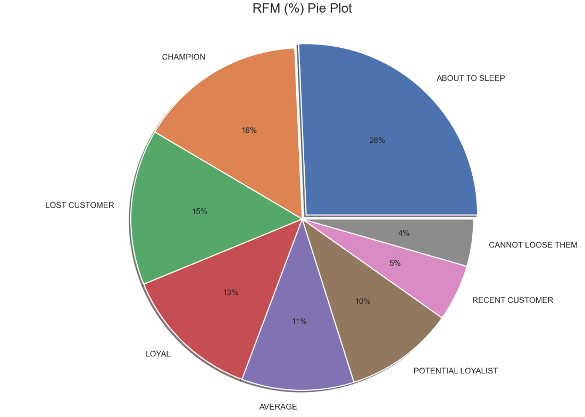

The size of the **About to Sleep** and **Lost Customer** groups suggests that strong historical purchasing did not automatically translate into continued engagement.

6. **Association rules identified possible bundle relationships.**
  *Table 1: French Bundles*
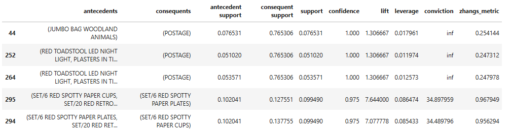
- French transactions showed a recurring relationship between red spotty paper cups and matching paper plates.

  *Table 2: UK Bundles*
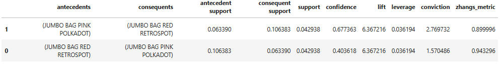
- UK transactions showed a strong relationship between red and pink retrospot jumbo bags.
- These findings are suitable for merchandising tests, but should not be treated as evidence of customer motivation without further validation.

#### **Recommendations**:

- Build targeted reactivation campaigns for **About to Sleep** and **Lost Customer** segments.
- Create progression offers for **Potential Loyalists** based on recent and repeated purchases.
- Protect **Champion** and **Loyal** customers through early-access, personalised, or service-led retention initiatives.
- Test product bundles using high-lift association rules instead of relying only on individual item popularity.
- Review extreme-quantity orders separately so that unusual wholesale-style purchases do not distort general customer-demand analysis.

#### **Technologies**:

**Python · Pandas · NumPy · Matplotlib · Seaborn · Plotly · HoloViews · Mlxtend · Apriori · RFM Analysis**

#### **Repository**:

[View the Data Analysis Repository](https://github.com/ZicoSabine/Data-Analysis)

 

  

### 04 - Nata Supermarket Business Analysis

#### **Objective**:

Examine customer demographics, product spending, purchase channels, household composition, complaints, and product associations to identify how a supermarket could improve customer understanding and modernise its use of data.

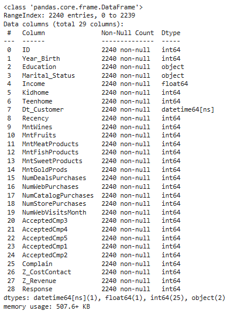

The project used **2,240 customer records** covering demographic and behavioural attributes, including income, education, marital status, household composition, product-category spending, purchase channels, campaign response, recency, and complaints.

#### **Data Preparation**:

- Reviewed data types and missing values.
- Replaced 24 missing income values with the dataset mean.
- Converted customer dates into a datetime format.
- Reshaped product-spending fields for category and association analysis.
- Grouped customers by income and household composition for comparison.

#### **Analytical Methods**:

- Customer demographic profiling
- Income-band segmentation
- Product-category spending comparison
- Purchase-channel analysis
- Weekly aggregation and Prophet forecasting experiments
- Apriori association-rule analysis by household type
* Complaint and customer-date trend analysis

#### **Findings**:

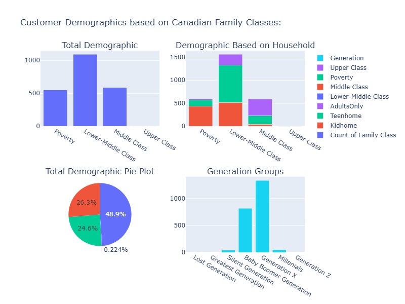

1. **Lower-middle-income households represented the largest customer group.**

The categories were constructed inside the notebook using fixed income thresholds and should be treated as an exploratory segmentation rather than an official socioeconomic classification.

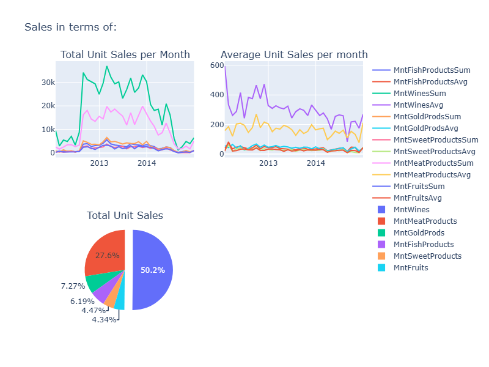

2. **Wine and meat represented the largest recorded product-spending categories.**

3. **Store purchasing remained the leading channel.**
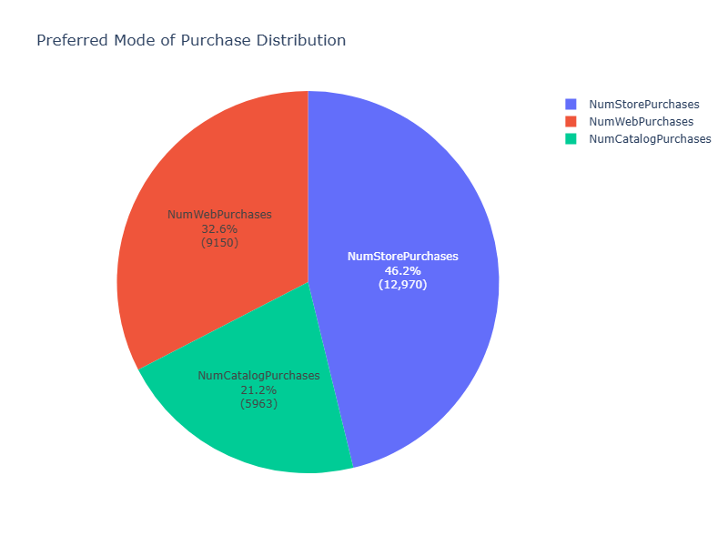

The result suggests that physical-store behaviour remained central, while web purchasing was still substantial enough to justify a stronger integrated customer-data strategy.

1. **Household-level association rules repeatedly linked product categories with meat purchases.**

   - Wine, fruit, fish, sweets, and gold-product spending frequently appeared alongside meat-product spending across several household segments.
   - Many rules had lift values close to `1`, meaning the apparent relationships were often driven by the high overall prevalence of meat purchases rather than unusually strong affinity.

2. **Forecasting was exploratory rather than operational.**

   - Prophet was tested across six product categories using an 80/20 split.
   - ARIMA outputs were incomplete in the executed notebook.
   - The time axis used customer enrolment date rather than individual transaction dates, so the forecasts should be interpreted as a technical experiment, not as validated demand predictions.

3. **Complaints were uncommon in the dataset.**

   - Only **21 of 2,240** customer records were marked as having submitted a complaint.

#### **Recommendations**:

- Prioritise a unified digital customer-data process connecting store, web, and catalogue activity.
- Use the dominant store channel as the foundation for customer identification rather than treating digital channels as separate systems.
- Design product-bundle tests only where association rules demonstrate meaningful lift, not merely high confidence.
- Replace enrolment-date forecasting with transaction-level sales data before making stock or demand decisions.
- Revisit income segmentation using context-appropriate, documented thresholds and explicit outlier treatment.

#### **Limitations**:

- The dataset contains customer-level cumulative spending rather than transaction-level sales history.
- Customer enrolment date is not an appropriate substitute for purchase date when forecasting demand.
- Income-band labels were manually constructed and are not externally validated.
- Several association rules were statistically weak because common product categories appeared in most baskets.

#### **Technologies**:

**Python · Pandas · NumPy · Plotly · Matplotlib · Seaborn · Prophet · Mlxtend · Apriori**

#### **Repository**:

[View the Data Analysis Repository](https://github.com/ZicoSabine/Data-Analysis)

 

  

### 05 - Online News Popularity Analysis

#### **Objective**:

Explore which article characteristics were associated with higher sharing activity and test how effectively the available features could predict article popularity.

The analysis focused on:

- Publishing day
- Content channel
- Keyword-related features
- Article length and structure
- Sentiment and subjectivity
- Predictive performance for article shares

#### **Data Source and Preparation**:

The project used the UCI Online News Popularity dataset, containing **39,644 Mashable articles** and 61 original attributes.

Preparation included:

- Removing leading whitespace from feature names
- Confirming that no duplicate URLs or missing values were present
- Removing URL, elapsed-time, and LDA-topic fields from the modelling feature set
- Applying an interquartile-range rule to the target variable to reduce extreme share-count outliers
- Retaining **35,103 articles** and **53 predictor features** for modelling
- Standardising features before linear and ridge regression

#### **Exploratory Findings**:

1. **Wednesday articles recorded the highest average shares.**
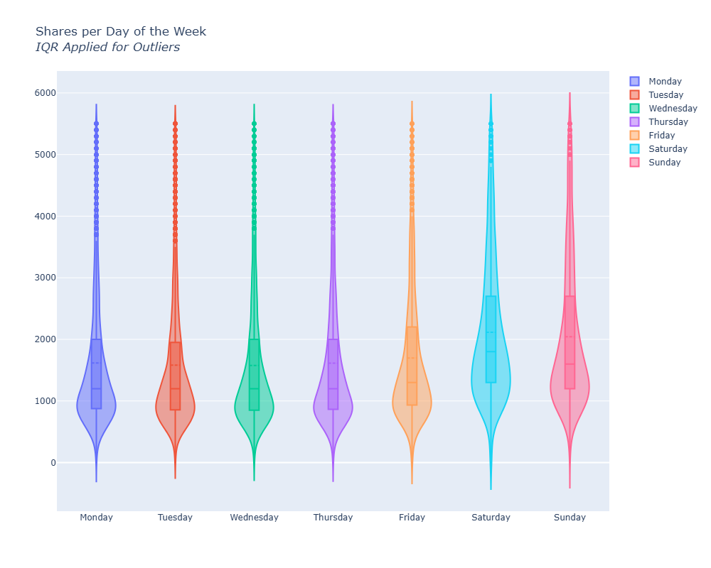

Weekend publication was associated with stronger average performance, but the dataset contains substantial variance and extreme values. The analysis therefore supports an association, not a causal claim that publishing on a weekend will make an article popular.

2. **Social Media content had the highest average shares among the labelled channels.**
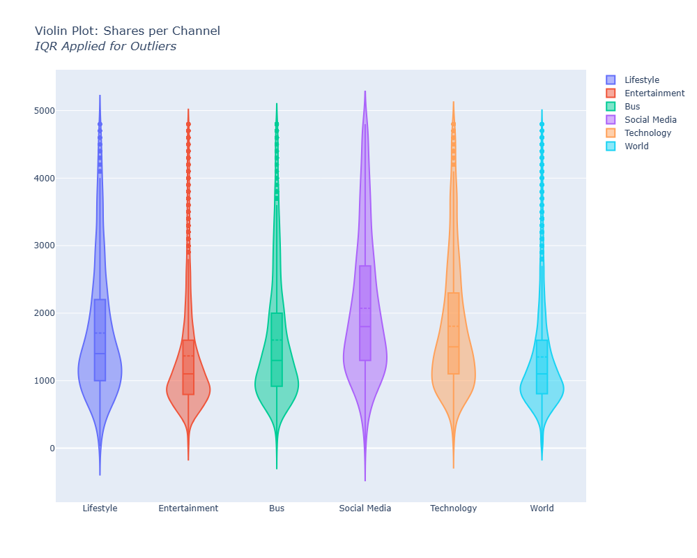

3. **Keyword and text characteristics were among the strongest Random Forest features.**

   - Average keyword performance was the most important feature in the fitted Random Forest model.
   - Other prominent features included maximum keyword averages, subjectivity, average token length, positive polarity, unique-token ratio, and content length.

#### **Evaluation Methods**:

Three regression approaches were compared using R-squared and mean-squared error:

| Model                   | Training R² | Validation/Test R² | Interpretation                     |
| ----------------------- | ----------: | -----------------: | ---------------------------------- |
| Linear Regression       |       0.111 |              0.089 | Limited explanatory power          |
| Random Forest Regressor |       0.876 |              0.093 | Strong overfitting                 |
| Ridge Regression        |       0.105 |              0.110 | Most stable result, but still weak |

The strongest test result explained only approximately **11% of the variance** in article shares. This suggests that popularity remained difficult to predict from the available features and that external factors—distribution, audience size, timing, platform amplification, and current events—likely played a substantial role.

#### **Recommendations**:

- Use weekend publishing as a scheduling hypothesis to test, not a guaranteed growth rule.
- Track keyword-history features and topic performance as editorial planning signals.
- Separate highly viral outliers from typical articles when evaluating expected performance.
- Compare regression against classification approaches, such as predicting whether an article exceeds a defined popularity threshold.
- Add publication-source, audience, referral, and social-distribution data before attempting operational share forecasts.

#### **Limitations**:

- The dataset records association rather than causation.
- Share counts are heavily skewed and influenced by extreme viral articles.
- Removing outliers improves model stability but also removes part of the phenomenon being studied.
- The fitted models had weak generalisation performance.
- The linear model contained highly collinear day-of-week variables, making raw coefficient interpretation unreliable.

#### **Technologies**:

**Python · Pandas · NumPy · Plotly · Matplotlib · Scikit-learn · Linear Regression · Ridge Regression · Random Forest Regression**

#### **Repository**:

[View the Data Analysis Repository](https://github.com/ZicoSabine/Data-Analysis)

